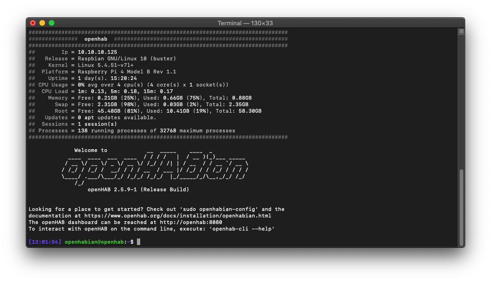
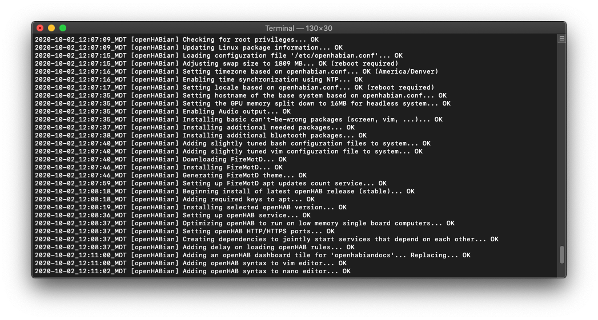
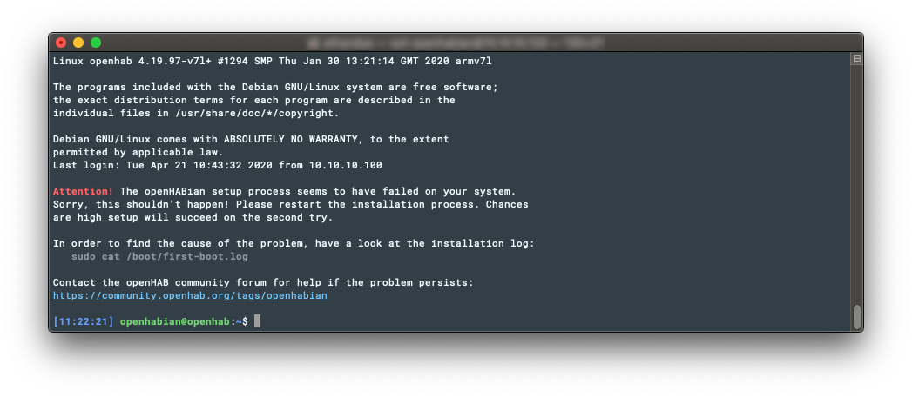



<!-- Attention authors: Do not edit directly. Please add your changes to the source repository -->

# openHABian - Hassle-free openHAB Setup
You just discovered openHAB and now you are eager to start but you're afraid of setting up a computer and OS for it ?

openHABian is here to help. It's a **self-configuring** Linux system setup to reliably operate your openHAB instance 24 hours a day.
It provides:

*   Complete **SD-card images pre-configured with openHAB** for the Raspberry Pi line of small single-board computers.
*   The openHABian configuration tool to set up and configure openHAB and many related things on any Debian based system

#### Table of Contents

{::options toc_levels="2..3"/}
-   TOC
{:toc}

## Features

The openHABian image provides lots of useful Linux tools out of the box:

-   Fully automated hassle-free setup without a need for a display or keyboard, connected via Ethernet or [Wi-Fi](#wi-fi-based-setup-notes)
-   All versions of openHAB to select from, including the latest stable one as the default
-   [Comprehensive capabilities to ensure your system will keep working reliably 24/7](#availability-and-backup) including ZRAM, [SD card mirroring](openhabian.md#sd-mirroring) and [Amanda backup system](openhabian-amanda.md)
-   Web based openHAB Log Viewer (based on [frontail](https://github.com/mthenw/frontail))
-   [Tailscale](https://tailscale.com/blog/how-tailscale-works/) VPN and [WireGuard](https://www.wireguard.com/) for remote VPN access
-   Samba file sharing [pre-configured ready to use shares](https://www.openhab.org/docs/installation/linux.html#mounting-locally)
-   Login information screen, powered by [FireMotD](https://github.com/OutsideIT/FireMotD)
-   The [Mosquitto](https://mosquitto.org) MQTT broker
-   The [InfluxDB](https://www.influxdata.com/) database to store home automation data and [Grafana](https://grafana.com/) to visualize it
-   FIND, the [Framework for Internal Navigation and Discovery](https://www.internalpositioning.com/)
-   Install and setup a [reverse proxy](security.html##running-openhab-behind-a-reverse-proxy) with password authentication and/or HTTPS access (incl. [Let's Encrypt](https://letsencrypt.org) certificate) for self-controlled remote access

The included **openHABian Configuration Tool** [`openhabian-config`](#openhabian-configuration-tool) provides the following optional settings and components:


### A note on dedication and commitment
openHABian is for starters *and* expert users. We sometimes read about people deciding against use of openHABian because they want to install additional software and believe openHABian does not let them do this.
Everybody wants their home automation to be stable and most people install a dedicated RPi, i.e. they don't install any other software there that may interfere with proper openHAB operation.
Reasonably so, this is our clear recommendation. Saving another 100 bucks is not worth putting the reliable day-to-day operations of your home at risk.

Then again that being said, those who really want to can use openHABian as the starting point for their 'generic' server and run whatever software else on top.
There's no genuine reason why this wouldn't work. The openHABian image is really just Raspberry Pi OS (lite) under the hood and openHABian is "just" some scripts that install a number of packages and configure the system in a specific way, optimized to run openHAB.

<a id="befair"></a>
#### and on fairness
What you must not do, though, is to mess with the system, OS packages and config and expect anyone to help you with that. Let's clearly state this as well: when you deliberately decide to make manual changes to the OS software packages and configuration (i.e. outside of openhabian-config), you will be on your own.
Your setup is untested, and no-one but you knows about your changes. openHABian maintainers are really committed to providing you with a fine user experience, but this takes enormous efforts in testing and is only possible with a fixed set of hardware. You don't get to see this as a user.

So if you choose to deviate from the standard openHABian installation (e.g. you change your box to run off SSD) and run into problems thereafter, please be fair: don't waste maintainer's or anyone's time by asking for help or information on your issues on the forum. Thank you !

## On openHAB 4 and older
openHABian will install **openHAB 4** and Java 17 by default.
The openHABian image will install openHAB 4 by default, to have it install openHAB 3 right from the beginning, set `clonebranch=openHAB3` in `openhabian.conf` before first boot. Use `clonebranch=legacy` to get openHAB 2.

## Hardware
### Hardware recommendation
Let's put this first: our current recommendation is to get a RPi model 4 or 5 with 2 or 4 GB of RAM, whatever you can get hold of for a good price, plus an "Endurance" SD card. If you want to be on the safe side, order the official 3A power supply, else any old mobile charger will usually do.
Cards labelled "Endurance" can handle more write cycles and will be more enduring under openHAB\'s use conditions.
Also prepare to make use of the [SD mirroring feature](openhabian.md#sd-mirroring), get a 2nd SD card right away, same model or at least the size of your internal one, plus a USB card reader.

### Hardware support
As of openHABian version 1.6 and later, all Raspberry Pi models are supported as hardware.
openHABian can run on x86 based systems but on those you need to install the OS yourself.
Anything else ARM based such as ODroids, OrangePis and the like may work or not.
NAS servers such as QNAP and Synology boxes will not work.

We strongly recommend Raspberry Pi 2, 3 or 4 systems that have 1 GB of RAM or more.
RPi 1 and 0/0W just have a single CPU core and only 512 MB of RAM. The RPi0W2 has 4 cores but only 512 MB as well.
512 MB can be sufficient to run a smallish openHAB setup, but it will not be enough to run a full-blown system with many bindings and memory consuming openHABian features/components such as zram or InfluxDB.
We do not actively prohibit installation on any hardware, including unsupported systems, but we might skip or deny to install specific extensions such as those memory hungry applications named above.

Supporting hardware means testing every single patch and every release.
There are simply too many combinations of SBCs, peripherals and OS flavors that maintainers do not have available, or, even if they did, the time to spend on the testing efforts that is required to make openHABian a reliable system.
It means that to run on hardware other than RPi 2/3/4/5 or bare metal x86 Debian may work but is not a supported setup.
Please stay with a supported version. This will help you and those you will want to ask for help on the forum focus on a known set of issues and solutions.

For ARM hardware that we don't support, you can try any of the [fake hardware parameters](openhabian.md#fake-hardware-mode) to 'simulate' RPi hardware and Raspberry Pi OS.

#### Hardware modifications
Plugging in HATs like an UPS or USB sticks or even SSDs for storage is fine, but we do not support attaching any hardware if that requires any sort of software or configuration changes on the OS part of openHABian.
To put it straight: we don't recommend SSDs and do not support attaching an SSD and move the system over there.
If you know Linux well enough to manually apply all the required modifications, feel free to do so but please be warned that this is a completely untested option that may work or not and what's even more important: it is unsupported. Don't ask for help if you run into trouble.
Also remember that any future changes to openHABian (which is what you get when you upgrade as you are recommended to do on every start of the `openhabian-config` tool) can interfere with any such modification of yours so while any such mod may work for the time being you apply it, it may break your box and openHAB experience anytime in the future.
Anybody afraid of SD card issues, use the [SD mirroring feature](openhabian.md#sd-mirroring) to mitigate.
This will provide you with a secondary, up to date SD card, available for swapping at any time.

### OS support
Going beyond what the RPi image provides, as a manually installed set of scripts, we support running openHABian on x86 hardware on generic Debian.
We provide code that is reported "as-is" to run on Ubuntu but we do not support Ubuntu so please don't open issues for this (PRs then again are welcome).
Several optional components such as WireGuard or Homegear are known to expose problems on Ubuntu.

Note with openHAB 4 and Java 17, `buster` and older distros are no longer supported and there'll be issues when you attempt upgrading Java 11->17.
Should you still be running an older distribution, we recommend not to upgrade the distro but to re-install using the latest openHABian image and import your config instead.

### 64 bit?
RPi 3 and newer have a 64 bit processor. There's openHABian images available in both, 32 and 64 bit.
Choose yours based on your hardware and primary use case. Please be aware that you cannot change once you decided in favor of either 32 or 64 bit. Should you need to revoke your choice, export/backup your config and install a fresh system, then import your config there.

Use the 64 bit image versions but please be aware that 64 bit always has one major drawback: increased memory usage. That is not a good idea on heavily memory constrained platforms like Raspberries. If you want to go with 64 bit, ensure your RPi has a mimimum of 2 GB, 4 will put you on the safe side.
You can use the 32 bit version for older or non official addons that will not work on 64 bit yet.
Note there's a known issue on 32 bit, JS rules are reported to be annoyingly slow on first startup and in some Blockly use cases.

On x86 hardware, it's all 64 bit but that in turn once more increases memory usage. A NUC to run on should have no less than 8 GB.

### Networking
You need to prepare your local network so you eventually need to configure your Internet router before an openHABian installation.
For image based installations, openHABian re-uses the TCP/IP networking setup Raspberry Pi OS is coming with.
The non-image (script-only) version of openHABian does not change anything about your existing OS' networking setup so you have to take care of that yourself before installing.

A working DHCP server is a mandatory prerequisite to openHABian's networking setup.
We recommend you configure your DHCP server to always assign the same IP based based on your RPi's MAC address.
That'll effectively get you a fixed IP address.
Most DHCP servers are part of your Internet router and have an option to allow for this type of mapping.
For example in AVM Fritz!boxes (popular in Germany), it's a simple checkbox you can tick - note it only appears after the address was assigned to a client (your openHABian box) for the first time.
Note it is NOT supported to setup openHABian with a static IP address as described in the Raspberry Pi OS documentation as that can interfere with openHABian functionality.
For reference, the RPi OS process is documented over here: <https://www.raspberrypi.org/documentation/configuration/tcpip/>.
If you are getting an `169.*` IP address it means DHCP didn't work.

When you boot a flashed image for the first time, openHABian will setup and use the Ethernet port if that one is connected with a cable to your LAN.
It'll also use the `wifi_ssid` and `wifi_password` parameters from `/boot/openhabian.conf` to determine whether and how to setup the Wi-Fi interface.
After these stages it checks for connectivity to the Internet and if that fails, it'll open a [Wi-Fi hotspot](#Wi-Fi-Hotspot) that lets you manually connect your system to a WLAN (Wi-Fi) of yours to jumpstart networking.
Remember that once the hotspot is started, it'll hide once you have successfully used it to connect your Wi-Fi interface but it'll return should your Wi-Fi connectivity break down.


## Raspberry Pi prepackaged SD card image

**Flash, plug, wait, enjoy:**
The provided image is based on the [Raspberry Pi OS Lite](https://www.raspberrypi.org/software/operating-systems/#raspberry-pi-os-32-bit) (previously called Raspbian) standard system.
openHABian is designed as a headless system, you will not need a display or a keyboard.
On first boot, the system will set up openHAB, its tools and settings.
Packages will be downloaded in their *newest* version and configured.
The whole process will take some minutes, then openHAB and all other tools required to get started will be ready to use without further configuration steps.

**Installation:**

-   Make sure you meet the [hardware prerequisites](#hardware) first
-   [Prepare your local router](#networking)
-   Write the image to your SD card using the official [Raspberry Pi Imager](https://www.raspberrypi.org/software/). openHABian can be selected via 'Other specific purpose OS / Home assistants and home automation'.
-   Alternatively, you can [download the card image file](https://github.com/openhab/openhabian/releases) and use any flash tool such as [Etcher](https://www.balena.io/etcher/).
-   Optionally, you can change a number of parameters *now* to affect the installation. See this section (https://www.openhab.org/docs/installation/openhabian.html#openhabian-conf). As a beginner or if in doubt what an option does, don't change anything.
-   Insert the SD card into your Raspberry Pi. Connect your Ethernet. If you want to use Wi-Fi instead, [configure Wi-Fi](#wi-fi-based-setup-notes) before booting  or use the hotspot function later on. **Do not attach a keyboard**. Power on and wait approximately 10-30 minutes for openHABian to do its magic. The system will be accessible by its IP or via the local DNS name `openhabian` and you can watch the install progress in your browser at [http://openhabian:81](http://openhabian:81). If for whatever reason networking does not work, openHABian will launch a [hotspot](#Wi-Fi-Hotspot) so if you see that, something's up with your networking.
-   Connect to the openHAB UI at [http://openhabian:8080](http://openhabian:8080)
-   [Connect to the Samba network shares](https://www.openhab.org/docs/installation/linux.html#mounting-locally)
-   Connect to the openHAB Log Viewer (frontail): [http://openhabian:9001](http://openhabian:9001)
-   **If you encounter any setup problem, [please continue here](#successful)**

When openHABian has installed and configured your openHAB system, you can start to use it right away.
[Connect to your Raspberry Pi SSH console](https://www.raspberrypi.org/documentation/remote-access/ssh/windows.md) using the username `openhabian` and password `openhabian`.
You should be seeing a welcome screen like the following:



➜ Continue at the ["openHABian Configuration Tool"](#openhabian-configuration-tool) chapter below.

### Wi-Fi Hotspot
When your openHABian box does not get Internet connectivity through either Ethernet or Wi-Fi (if configured), openHABian will launch a **hotspot**.
Use your mobile phone to scan for Wi-Fi networks, you should be seeing a new network called `openHABian-<n>` with `<n>` being a digit.
Connecting will work without a password. Once connected, most smartphones will transfer you to a web page.
If this does not happen on your mobile device, open your browser on the mobile and point it at `http://raspberrypi.local` or `http://comitup-<n>`.
This may or may not work for your mobile browser as it requires Bonjour/ZeroConf abilities.
If you cannot connect to this address, go to `http://10.41.0.1`.
On that page you can select the SSID of the network you want to connect your system to.
Provide the password and press the button.
Note that as soon as you do, the wlan0 IP address of your system changes so your mobile browser will not be able to provide you any feedback if that worked out.
Try to ping the new system's hostname (default is `openhabian`) or check DHCP on your router if your openHABian system appeared there.
You can use `sudo comitup-cli` inside openHABian to change networks and eventually remove network credentials.
Note the hotspot may not only become available during installation: it will remain on standby and will show up again every time your `wlan0` interface is losing connectivity.
For more information on hotspot functions see [comitup-cli](https://davesteele.github.io/comitup/). Most behavior can be tweaked by setting parameters (such as a default password) in `/etc/comitup.conf`.
The hotspot feature is known to work on RPi0W, RPi3 and newer but is known to often expose problems with Wi-Fi USB adapters.

<a id="manual-setup"></a>
### Other Linux Systems (add openHABian just like any other software)
Going beyond what the RPi image provides, you can also install openHABian on x86 hardware on top of any existing Debian installation.
Please note that the unattended install is tailored to work for Raspberries.
We cannot test HW/OS combos beyond RPis upfront so there is no promise for this work.
Note that although the core parts of openHABian were reported to work on Ubuntu, it is not supported and untested.
If you try and fail, please help and drop us a note on GitHub with debug log enabled, see [DEBUG guide](openhabian-DEBUG.md).

Start with a fresh installation of your operating system, login and run

``` bash
# start shell as root user
sudo bash
```

then start installation

``` bash
# install git - you can skip this if it's already installed
apt-get update
apt-get install git

# download, link and create config file
git clone -b openHAB https://github.com/openhab/openhabian.git /opt/openhabian
ln -s /opt/openhabian/openhabian-setup.sh /usr/local/bin/openhabian-config
cp /opt/openhabian/build-image/openhabian.conf /etc/openhabian.conf
```

Edit `/etc/openhabian.conf` to match your needs, then finally use

``` bash
openhabian-config unattended
```

to install.

## openHABian Configuration Tool

The following instructions are written for a Raspberry Pi but should be applicable to all hardware / all openHABian environments.
Once connected to the command line console of your system, please execute the openHABian configuration tool by typing the following command:

(Hint: sudo executes a command with elevated rights and will hence ask for your password. The default is `openhabian`).

``` bash
sudo openhabian-config
```


The configuration tool is the heart and center of openHABian.
It is not only a menu with a set of options but also used in a special unattended mode to automate the setup run, either as part of the RPi image or in a manual install run.

⌨ - A quick note on menu navigation.
Use the cursor keys to navigate, <kbd>Enter</kbd> to execute, <kbd>Space</kbd> to select and <kbd>Tab</kbd> to jump to the actions on the bottom of the screen.
Press <kbd>Esc</kbd> twice to exit the configuration tool.

### First steps with openHAB

After your first setup of openHABian completed successfully, please access the openHAB dashboard to dig into its possibilites.
Check out the [openHAB primers tutorial](https://www.openhab.org/docs/tutorial/).
Be sure to read up on the [Configuration](https://www.openhab.org/docs/configuration/) section of the documentation pages to learn more.

### Linux Hints

If you're a newbie to Linux, you sooner or later will have to know some Linux if you want to copy some files or are on the search for a solution to a problem.
Take some time at this stage to study tutorials and get to know the most basic commands and tools to be able to navigate on your Linux system, edit configurations, check the system state or look at log files.

-   "Learn the ways of Linux-fu, for free" interactively with exercises at [linuxjourney.com](https://linuxjourney.com).
-   The official Raspberry Pi help articles over at [raspberrypi.org](https://www.raspberrypi.org/help)
-   "Now what?", Tutorial on the Command line console at [LinuxCommand.org](http://linuxcommand.org/index.php)

### more openHABian configuration

openHABian is supposed to provide a ready-to-use openHAB base system.
There are a few things, however, we need you to decide and act on right now at the beginning:

-   **Timezone:** The time zone of your openHABian system will be determined based on your internet connection.
    In some cases you might have to adjust that setting.
-   **Language:** The `locale` setting of the openHABian base system is set to "en_US.UTF-8".
    While this setting will not do any harm, you might prefer e.g. console errors in German or Spanish.
    Change the locale settings accordingly.
    Be aware, that error solving might be easier when using the English error messages as search phrases.
-   **Passwords:** Relying on default passwords is a security concern you should care about!
    The openHABian system is preconfigured with a few passwords you should change to ensure the security of your system.
    This is especially important if your system is accessible from outside your private subnet.

All of these settings can be changed via the openHABian configuration tool.

Here are the passwords in question with their respective default "username:password" values.
They can be changed from openHABian menu.

### Passwords

-   User password needed for SSH or sudo (e.g. "openhabian:openhabian")
-   Samba share password (e.g. "openhabian:openhabian")
-   openHAB remote console (e.g. "openhab:habopen")
-   Amanda backup password (no default, applied when installing)
-   Nginx reverse proxy login (no default, applied when installing) _For manual configuration see [here](https://www.openhab.org/docs/installation/security.html#adding-or-removing-users)._
-   InfluxDB (No password set by default)
-   Grafana visualization ("admin:admin")

## Availability and Backup

openHABian is designed to reliably run 24 hours a day, seven days a week. That's a complex challenge involving hardware, software and operational procedures.
This is the right time to prepare your system for disasters such as getting hit by hardware outages or the SD card wear-out/corruption problem.

Preparing for hardware breakage is the challenge that is the most easy one to overcome with common-off-the-shelf hardware that is known to work as a drop-in replacement the very moment you will be in need of it (i.e. when your smart home server just died).

::: tip get your spare hardware ready
Order **spare** pieces of *all* hardware components your home automation relies on to work. At a minimum, that's the computer itself and another storage medium.
Have it ready for use *on site*, unboxed, mounted and tested to be working.
:::

HEADS UP: that statement applies to EVERY hardware setup, even if you run openHAB in some virtualization environment on a $$$ x86 server rackmounted in your basement.
For our recommended hardware setup that means getting another Raspberry Pi (same model), 2 more SD cards and a power supply (in case of emergency, a smartphone charger will also do).

That being said, openHABian has a number of built in software features we borrowed from professional data center operations.

1.  SD cards are known they can 'wear out' after some time and crash your OS and openHAB setup and data when they do. See [this community forum post](https://community.openhab.org/t/corrupt-filesystems-every-2-3-month/13057/20) for more information.
    The Zram feature moves write intensive parts of openHABian into RAM to mitigate the risk of SD card corruption.
    WARNING: power failure will result in some data to get lost (albeit the system should continue to run) so we recommend to also get an UPS.
    Zram is enabled by default for swap, logs and persistence data.
    You can toggle use in \[menu option 38\].
2.  Mirror your SD card!
    Get an USB card writer and another SD card and set up SD mirroring using \[menu option 53\].
    This will ensure you have an always ready-to-use clone of your storage medium handy at all times.
    In case of emergency, you can simply swap SD cards and get back online within just a few minutes.
    See [auto backup](#sd-mirroring) documentation.

::: tip remote replacement
Disasters love to happen when you're not at home. 
With an openHABian RPi mirror SD setup, you can instruct your partner or even kid or your cottage neighbour to replace the SD card and/or computer from remote, by phone. No need for Internet access.
:::

3.  Use the integrated original openHAB [openhab-cli tool](https://community.openhab.org/t/recommended-way-to-backup-restore-oh2-configurations-and-things/7193/82) at regular intervals to interactively backup/restore your openHAB **config** \[menu option 50/51\].
4.  Use [Amanda Network Backup](http://www.amanda.org/) to create full system backups.
    HEADS UP: This is NOT meant to be a replacement for #1 or #3, it's a *complement* that will also enable you to restore your system to any point in time of the past.
    The specific [Amanda documentation is here](openhabian-amanda.md).
    Use \[menu option 52\] to set up.
5.  For completeness, openHABian still provides the historic option to move the root filesystem to USB-attached devices. See \[menu option 37\].
    We don't recommend or support doing so but if you're convinced this is beneficial to your situation, feel free to go for it.

    WARNING 1: openHABian maintainers do not support you in applying hardware modifications to have an effect on the system itself such as to add an SSD drive to boot from.
    We clearly recommend not to do this, for your own sake of reliability.

    WARNING 2: USB sticks are as susceptible to flash wear-out as SD cards are, making zram the better choice for a standard Pi to run off its internal SD card.

Standard openHABian install enables zram by default (#1).
You can disable zram and move the system over using menu options 37 (#5) once you attached a _safe_ external medium to your system (such as an SSD), but we recommend against doing so.
[To restate](#befair): this setup is not supported by us maintainers and you'll be on your very own to find and fix any problems you might run into.

Finally, we strongly suggest you install Amanda (#4) right after you finish your setup.
Amanda is to take care to backup the whole system to be able to quickly restore it when in need.
This is not done by default because it requires a number of user inputs, but you should not skip it for your own safety!

## Setup notes
### `openhabian.conf`

You can actually set a number of parameters _before_ you run an unattended installation.
This applies to the RPi image on an SD card as well as to a manual installation.
You can also try with a different set of parameters if your initial attempt fails:

-   Flash the system image to your micro SD card as described, do not remove the SD card yet 
-   Use Windows file explorer to access the first SD card partition. Re-plug if needed to open in Windows file explorer, it's a vfat/FAT-32 (Windows) filesystem.
-   Open the file `openhabian.conf` in a text editor
-   Uncomment and complete the lines to contain the parameters you want to set
-   Save, unmount/eject, remove and insert into the RPi and boot it
-   Continue with the instructions for your hardware

Mind the comments for each configuration parameter. Browse the next documentation section for more explanations.

#### Initial configuration
You can have openHABian import a working openHAB configuration right from the start at installation time like when you migrate or reinstall:
make the `initialconfig` parameter point to either a file or URL.
Note that you can only place config zipfiles on the 1st (Windows) partition, and that partition will finally be accessible as `/boot` from inside Linux.
So a filename would need to be `/boot/xxx.zip`. Default is `/boot/initial.zip`.
So if you have a openHAB configuration backup zipfile (created e.g. by using menu option 50), put it to the E: device that the first partition of your SD card shows up as on a Windows PC and change its name to 'initial.zip'.

#### Administration user
Raspberry Pi OS images include a Linux user (`pi`) that you can use for openHAB administration.
openHABian renames the user to what you specify in the `username` parameter and assigns the `userpw` password first, then it proceeds and makes various settings that are either useful (such as some aliases) or required to run openHAB.
You can also make use of this if you don't use the image but unattended installation on non-RPi hardware, openHABian will then _create_ that user for you if it does not yet exist.

#### Admin key
Make the `adminkeyurl` point to an URL to contain a public SSH key.
This will be included with your administration user's `.ssh/authorized_keys` and the openHAB console so the admin user (yourself, usually) can login right after installation  without a password. This helps with automating deployments.

#### Wi-Fi based setup notes
To setup openHABian via Wi-Fi only, make your SSID and password known to the system before the first boot.
In addition to the setup instructions given above, uncomment and complete the lines reading `wifi_ssid=""` and `wifi_password=""` in `openhabian.conf`.

#### Disable zram
Zram is activated by default on fresh installations on ARM hardware.
If you want to disable zram for some reason, use `zraminstall=disable` in `openhabian.conf` to install without.

#### Debug mode
See [Troubleshooting](#troubleshooting) section if you run into trouble installing.
If you want to turn on debug mode edit `openhabian.conf` and set the `debugmode=` parameter to either `off`, `on` or `maximum`.
Mind you that if you intend to open an issue, we need you to provide the output of `debugmode=maximum` so if you're in interactive mode, set your terminal to record output.

#### Auto backup
Auto backup is a marketing name for two distinct features that you can deploy in one go at _unattended_ installation time on a RPi (when you deploy the image).
Technically it is a "low-cost" version of disk mirroring PLUS the setup of the Amanda backup system which all by itself has been available in a long time.
So don't let the name confuse you. If you didn't choose to set this up at installation time, you can also individually select these functions via `openhabian-config` menu options 53 (mirroring) and 52 (Amanda).
Note mirroring is available on RPi hardware only while Amanda as the backup system is available on any openHABian-supported hardware-OS combo.

#### SD mirroring
SD cards are known to 'wear out' the more you write to them.
The SD mirroring feature uses an USB-attached card writer to keep a 2nd SD card in (loose) sync with the internal card. In case of the primary SD card to fail, you can easily swap cards to relaunch your OH and get it working again within just minutes. You can even instruct others with physical access if you cannot be on site, and you can make use of this feature to create system copies that you can store off-site to recover your smart home server in case a disaster happens.

To setup openHABian to automatically backup and mirror your internal SD card to an external storage unit, we suggest to use another SD card in an external card writer device so that in case your internal SD card fails, you can switch SD cards to get the system back up running fast.

We recommend to put in another card that has at least _twice_ the size of the internal card. We can make use of that extra space as storage for the backup system.
Note most "16GB" cards are not _exactly_ 16 GB and your mirror mustn't have less bytes than the internal one so at setup time, openHABian ensures the second card has at least the same size as your internal card.

::: tip NO Do-It-Yourself mirroring
Note you must NOT use `dd` or any other tool such as 'Win32 disk imager' to copy an SD card or partition on your own. If you do and boot with source and destination cards plugged in, they will have the same partition IDs and this will likely mess up things and can irreversibly devastate your whole system. Use the `blkid` command in shell to see those IDs. This also means you must not take _mirrors_ of the _mirror_.
Also be aware that only the first two partitions are mirrored - the storage (3rd) partition will never be mirrored even if you have set that up for use as your backup area.
:::

To setup mirroring right during unattended installation of a RPi (using the image flash method):<br>
Define `backupdrive=/dev/sdX` (replace X with the proper character) to enable this functionality right during unattended installation.
The first attached disk type device is usually called `/dev/sda`.
Use `storagecapacity=xxx` to override how much space to consume at most for Amanda backup storage (in MB).
openHABian will create partitions 1 and 2 to be mirrors of your internal card and will assign the remaining space to another partition that you can use for storage.
NOTE: if you do and _if_ the remaining space is sufficient, selecting this will also result in setting up the Amanda backup system on that extra space.
You can change where it stores its backup data via `storagedir=/storage`, but you cannot unselect the Amanda setup at this stage.
If you want to setup mirroring only and Amanda anywhere else but on the extra SD space, you must not choose unattended installation method (i.e. do not define `backupdrive`).
You can still setup both, mirroring and Amanda, separately at any later time using the 53 (mirroring) and 52 (Amanda) menu options.

Full mirroring of the full SD card will take place semiannually and only for the 2nd partition (Linux root), changes will be synced once every day.
See `systemctl list-timers`, timers are defined in `/etc/systemd/system/sd*.timer`.


Menu 5X provides interactive access to the aforementioned functions:<br>
`52 Amanda System Backup` will prepare an existing directory as your backup storage and make Amanda launch once a day. See the separate [Amanda setup document](openhabian-amanda.md).
`53 Setup SD mirroring` prepares the partitions on an SD card and sets up timers to execute both, a full mirroring and complementary rsync 'diff' runs.
`54 Raw copy SD` is a one-time raw copy (mirror) run.
`55 Sync SD` propagates (syncs) differences from your main SD card to your external card.

In case of failure of your primary SD card, replace the broken SD card in the internal slot with your backup card from the external reader. Get another SD card that matches the size of the backup (now in internal slot) card and use menu option 54 to copy your active backup card back to the new one.

#### Tailscale VPN network
Tailscale is a management toolset to establish a WireGuard based VPN between multiple systems if you want to connect to openHAB(ian) instances outside your LAN over Internet.
It'll take care to detect and open ports when you and your peers are located behind firewalls.
[Download the client](https://tailscale.com/download) and eventually get the Solo service plan from Tailscale, that's free for private use and will automatically be selected when you fire up your first VPN node.
The Windows client has a link to the admin console where you can create pre-auth one-time keys.
These you can put as the `preauthkey` into `openhabian.conf` to automatically deploy remote openHABian nodes (unattended install) and have them join the VPN.
The `tstags` option allows you to specify tags for use in [Tailscale ACL](https://tailscale.com/kb/1018/acls/) definition.

#### IPv6 notes
You might encounter problems when you make use of IPv6 on some networks and systems. openHABian installation may stop or hang forever.
In that case _or if you are sure that you do not need IPv6 on your openHABian server_, you can disable IPv6.
Follow the instructions in the previous section and insert a line into `openhabian.conf` reading `ipv6=disable`.

#### Fake hardware mode
If to install openHABian fails because you have a non-supported hardware or run an unsupported OS release, you can "fake" your hardware and OS to make openHABian behave as if you did own that HW/OS.
In `openhabian.conf`, uncomment and complete the lines reading `hw=`, `hwarch=` and/or `osrelease=` with the hw and os versions you want to attempt installation with.

## Optional Components
openHABian comes with a number of additional tools to quickly install and set up additional home automation related software.
You'll find all of these in the [openHABian Configuration Tool](#openhabian-configuration-tool), menu option 20.

-   [Frontail](https://github.com/mthenw/frontail) - openHAB Log Viewer accessible from [http://openhabian:9001](http://openhabian:9001)
-   [InfluxDB and Grafana](https://community.openhab.org/t/influxdb-grafana-persistence-and-graphing/13761/1) - persistence and graphing available from [http://openhabian:3000](http://openhabian:3000)
-   [Eclipse Mosquitto](http://mosquitto.org) - Open Source MQTT v3.1/v3.1.1 Broker
-   [Node-RED](https://nodered.org) - "Flow-based programming for the Internet of Things". Access at [http://openhabian:1880](http://openhabian:1880).
-   [Homegear](https://www.homegear.eu/index.php/Main_Page) - Homematic control unit emulation
-   [KNXd](http://michlstechblog.info/blog/raspberry-pi-eibknx-ip-gateway-and-router-with-knxd) - KNX daemon running at `224.0.23.12:3671/UDP`
-   [OWServer](http://owfs.org/index.php?page=owserver_protocol) - 1wire control system
-   [FIND](https://www.internalpositioning.com/) - the Framework for Internal Navigation and Discovery
-   Mi Flora MQTT demon

## Troubleshooting
If you're having problems with getting openHABian to install properly, check out the [debug guide](openhabian-DEBUG.md). It's also available on your system as `/opt/openhabian/docs/openhabian-DEBUG.md`.
You can ask for help on the [openHABian community forum](https://community.openhab.org/) when the debug guide doesn't help but please first, read and [mind the rules](https://community.openhab.org/t/how-to-ask-a-good-question-help-us-help-you/58396).

If you want to get involved, you found a bug, or just want to see what's planned for the future, visit us on GitHub:

-   [https://github.com/openhab/openhabian/](https://github.com/openhab/openhabian/)

<a id="changelog"></a>
### Where can I find a changelog for openHABian?
Official announcements are displayed on starting `openhabian-config` and stored in `NEWS.md` (a file in `/opt/openhabian`).
Release notes are also co-located with the download links [here](https://github.com/openhab/openhabian/releases).
If you want to stay in touch with all the latest code changes under the hood, see [commit history](https://github.com/openhab/openhabian/commits/main) for openHABian.
You'll also see commits "fly by" when executing the "Update" function within the openHABian Configuration Tool.

<a id="successful"></a>
### Did my Installation succeed? What to do in case of a problem?
openHABian setup will take 15 up to 45 minutes to complete all steps, depending on your device's performance and your internet connection.

Watch the progress on the console or the web interface at <http://(yourIP):81/> or <http://openhabian:81/> if that name has become available.
Double-check the IP address and name with your router while you wait.
If there is absolutely no output for more than 10 minutes, there probably is a problem with the way your router or local network are setup.
Read on in the [Troubleshooting](#troubleshooting) section.
Set `debugmode=maximum` in `openhabian.conf` to see what openHABian is doing.

After a few minutes of boot up time, you can [connect to the SSH console](https://www.raspberrypi.org/documentation/remote-access/ssh/windows.md) of your device.
During the setup process you'll be redirected to the live progress report of the setup (you can Ctrl-C to get into the shell).
The report can also be checked for errors at any time, see `/boot/first-boot.log`.

The progress of a successful installation will look like this:



Wait till the log tells you that the setup was "successful", then reconnect to the device.

#### SSH Login Screen

If the installation was **successful** you will see the normal login screen as shown in the first screenshot.
If the installation was **not successful** you will see a warning and further instructions as shown in the second screenshot.

<div class="row">
  <div class="col s12 m5"></div>
  <div class="col s12 m5 offset-m2"></div>
</div>

#### openHAB Dashboard

After the installation of openHABian was successful, you should be able to access the openHAB dashboard:

-   Raspberry Pi image setup: [http://openhabian:8080](http://openhabian:8080)
-   In any case: [http://your-device-hostname:8080](http://your-device-hostname:8080) or [http://192.168.0.2:8080](http://192.168.0.2:8080) (replace name/IP with yours)

If you are not able to access your system via the openHAB dashboard or SSH after more than one hour, chances are high that your hardware setup is the problem.
Consult the [debug guide](openhabian-DEBUG.md) and move on from there.

<a id="switch-openhab-branch"></a>
#### Can I switch openHAB 2 and 3 via openHABian branches?

openHABian installs the latest release build of openHAB, 4.1.1 at the time of writing.
The standard openHABian `openHAB` and `main` branches will install the new openHAB version 4 and the old `openHAB3` and `legacy` branches will install the outdated openHAB version 3 or 2, respectively.
You can migrate between openHAB software versions by selecting the corresponding 4X menu option. (HEADS UP: Downgrading openHAB is not supported and will probably result in a broken system until you also restore an openHAB 3 configuration).
If you want to choose from release (stable), snapshot or milestone releases, please do so via `openhabian-config` tool (also menu 4X).
Switching to newer development releases might introduce changes and incompatibilities, so please be sure to make a full openHAB backup first.

<a id="headache"></a>
#### Where is the graphical user interface?

I've just installed openHABian and now I'm confused.
No fancy login screen, no windows, no mouse support.
What did I get into?

You are not the first one to get confused about the intended use case of openHABian.
Maybe it helps to not think of the RPi as a PC as we know it.
An RPi is not (well, not _necessarily_) to be used with a keyboard and display.
Its intended use case is to sit in a corner and provide a service reliably 24 hours a day, 7 days a week.
You already own a powerful PC or Mac to work on.

What we actually want openHABian to be is a **dedicated, headless system** to **reliably operate your home automation** on and to expose all interfaces needed to interact and configure it (MainUI, openHAB LogViewer, Samba Network Shares, openHABian maintenance tool, SSH, you-name-it).
If you know how to work with these interfaces, you are set for a way better experience than the alternatives.
The main challenge is to **get used to the Linux command line**, not even a GUI will relieve you from that in the long run.
If you are not willing to teach yourself a few fundamental Linux skills you will not become happy with any Linux system and should resort to a e.g. Windows machine.
However as you are willing to tinker with smart home technology, I'm sure you are ready to **teach yourself new stuff** and expand your experience.
