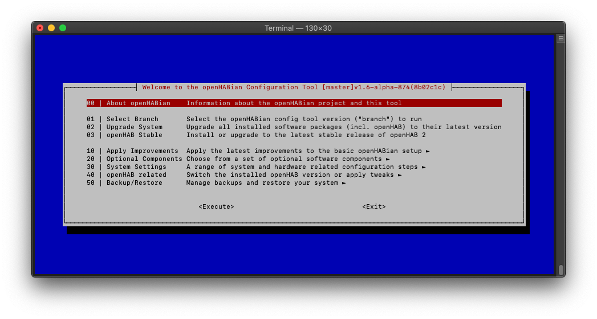



<!-- Attention authors: Do not edit directly. Please add your changes to the source repository -->

# openHABian - Hassle-free openHAB Setup

You just discovered openHAB and now you are eager to start but you're afraid of setting up a standalone system for it?

openHABian is here to help.

[[toc]]

## Features

openHABian is a **self-configuring** Linux system setup to reliably operate your openHAB instance 24 hours a day.

A fresh install provides:

-   Complete **SD-card images pre-configured with openHAB** for the Raspberry Pi line of small single-board computers
-   The openHABian configuration tool to set up and configure openHAB and many related things on any Debian based system
-   Fully automated hassle-free setup without a need for a display or keyboard, connected via Ethernet or Wi-Fi (see [networking](#wi-fi-based-setup-notes))
-   Samba file sharing [pre-configured ready to use shares](https://www.openhab.org/docs/installation/linux.html#mounting-locally)
-   [ZRAM](https://www.github.com/ecdye/zram-config) to reduce wear on SD cards

With many more optional features available in the `openhabian-config` menu.



## Getting Started with openHABian

openHABian is for starters *and* expert users.
openHABian provides a solid base for openHAB and can be configured in any number of ways after the initial install.
We suggest that users keep the packages on the system all openHAB related, this will help keep the system as stable as possible.

This advice works well with the idea of a single board computer (SBC) as they are meant to cheap and affordable to be used for a single purpose.
Therefore our recommendation is to dedicate a single system (typically a Raspberry Pi) to your openHAB instance and any related software.

With that being said, we can't and won't stop you from doing whatever you want, but don't say we didn't warn you.

### Hardware

#### Hardware Recommendation

Our current recommendation is to get a Raspberry Pi model 4 or 5 with 2 or 4 GB of RAM, whatever you can get for a good price.
Older RPi models (or models with less RAM) can be sufficient to run a smallish openHAB setup.
Please note that running 64bit mode on RPi's with only 1 GB of RAM tends not to work super well.

You will need an SD card to go along with your Raspberry Pi, SD cards labelled "Endurance" are best for openHABian.
Cards labelled "Endurance" can handle more write cycles and will typically last longer for openHAB's use conditions.

Ideally you should purchase two SD cards, and a USB adapter for the second card so that you can make use of the [SD mirroring](#sd-mirroring) feature.
This will give you a ready to go drop in replacement in the case of any hardware issues later on.

#### Hardware Support

All Raspberry Pi models are supported by openHABian.

::: info Note
With the upcoming openHAB 5 release, we will drop support for anything older than an RPi 3 as openHAB 5 will require a 64 bit processor.
:::

openHABian can run on x86 based systems but you will need to install debian yourself.
See [installation on other Linux systems](#installation-on-other-linux-systems) for directions on what to do.

All other system combinations do not have official support.
We do not actively prohibit installation on any hardware, including unsupported systems, *but we will **not** offer support for any issues you encounter*.

We **strongly** suggest that you stay with a supported version.
This will help you and those you will want to ask for help on the forum focus on a known set of issues and solutions.

##### 32/64 Bit Image Support

Any RPi 3 or newer supports 64 bit operation.
Unless you really know what you are doing and have a compelling reason to do so, stick with the 64 bit image.
If you do install a 32 bit image, please note that you will be unable to upgrade to openHAB 5 in the future.

On systems with only 1 GB of RAM running the 64 bit image may cause issues as there may not be sufficient RAM.
If you observe issues please consider upgrading to a model with more that 1 GB of RAM.

### Networking

You need to connect your Raspberry Pi to the network by Ethernet or configure Wi-Fi settings before first boot.
If you plan on using Wi-Fi see [first boot configuration](#first-boot-configuration) for how to configure those settings.

If we fail to connect to any networks on first boot, we will try to open a [Wi-Fi hotspot](#Wi-Fi-Hotspot) that will allow you to connect your Raspberry Pi to Wi-Fi from another device.
The hotspot is temporary and will close once the Wi-Fi connects successfully.
If connection fails the hotspot will return for you to try again.

#### Wi-Fi Hotspot

When your openHABian box does not get Internet connectivity through either Ethernet or Wi-Fi (if configured), openHABian will launch a **hotspot**.
Use your mobile phone to scan for Wi-Fi networks, you should be seeing an new unprotected network called `openHABian-<n>` with `<n>` being a digit.
Once connected, most smartphones will transfer you to a web page.
If this does not happen on your mobile device, open your browser on the mobile and point it at [http://raspberrypi.local](http://raspberrypi.local).
If you cannot connect to this address, go to [http://10.41.0.1](http://10.41.0.1).

On that page you can select the SSID of the network you want to connect your system to.
Provide the password and submit it be aware that as soon as you do, the system will immediately stop the hotspot and attempt to connect to the specified network.
As such your browser will be unable to provide any indication of if the operation succeeded.

Try to ping the new system's hostname (default is `openhabian`) or check DHCP on your router to see if your openHABian system appeared there.
You can use `sudo comitup-cli` inside openHABian to change networks and eventually remove network credentials.

Note that the hotspot will remain on standby and will show up again every time your `wlan0` interface is losing connectivity.
For more information on the hotspot functions see [comitup documentation](https://davesteele.github.io/comitup/).
Most behavior can be tweaked by setting parameters (such as a default password) in `/etc/comitup.conf`.
The hotspot feature is known to work on RPi3 and newer but can expose problems when used with USB Wi-Fi adapters.

### Installation on Raspberry Pi Systems

**Flash, plug, wait, enjoy:**

The provided image is based on [Raspberry Pi OS Lite](https://www.raspberrypi.org/software/operating-systems/#raspberry-pi-os-32-bit) (previously called Raspbian).
openHABian is designed as a headless system, you will not need a display or a keyboard.
On first boot, the system will set up openHAB, its tools and settings.
Packages will be downloaded and configured in their *newest* version.
The whole process will take some time and if all goes well openHAB will be setup and ready to go without needing any additional configuration.

**Installation:**

-   Make sure you meet the [hardware prerequisites](#hardware) first
-   Write the image to your SD card
    -   Use the official [Raspberry Pi Imager](https://www.raspberrypi.org/software/) select: 'Other specific-purpose OS -> Home assistants and home automation -> openHAB'
    -   Alternatively download the latest release from [here](https://github.com/openhab/openhabian/releases/latest) and flash using a tool like [Etcher](https://etcher.balena.io)
-   Change any settings you want (see [first boot configuration](#first-boot-configuration))
-   Insert the SD card into your Raspberry Pi
-   Prepare whatever networking you need (see [networking](#networking))
-   Power on and wait approximately 10-30 minutes for openHABian to do its magic
    -   You can watch the install progress in your browser at [http://openhabian:81](http://openhabian:81) or whatever your IP address is if the hostname does not work
    -   If for whatever reason networking does not work, openHABian will launch a [hotspot](#Wi-Fi-Hotspot)
-   Connect to the openHAB UI at [http://openhabian:8080](http://openhabian:8080) and make your home smart
-   If you encounter any issues, see [troubleshooting](./openhabian-troubleshooting.md)

When openHABian has installed and configured your openHAB system, you can start to use it right away.

### Installation on Other Linux Systems

You can install openHABian on x86 hardware on top of an existing Debian installation.
Please note that the install process is tailored to work for RPi systems.
We cannot test systems outside of RPis upfront so there may be some issues we cannot anticipate that come up.

Although the core parts of openHABian were reported to work on Ubuntu, it is not supported and untested.
If you try and fail, please help and drop us a note on GitHub with debug log enabled, see [troubleshooting](./openhabian-toubleshooting.md).

Start with a fresh installation of Debian, login and run:

``` bash
# start shell as root user
sudo bash

# install git - you can skip this if it's already installed
apt-get update
apt-get install git

# download, link and create config file
git clone -b openHAB https://github.com/openhab/openhabian.git /opt/openhabian
ln -s /opt/openhabian/openhabian-setup.sh /usr/local/bin/openhabian-config
cp /opt/openhabian/build-image/openhabian.conf /etc/openhabian.conf
```

Edit `/etc/openhabian.conf` to match your needs (see [first boot configuration](#first-boot-configuration)).
To start the openHABian setup process run:

``` bash
openhabian-config unattended
```

When openHABian has installed and configured your openHAB system, you can start to use it right away.

## Going further with openHABian

### openHABian Configuration Tool

The following instructions are written for a Raspberry Pi but should be applicable to all openHABian environments.
Once connected to the command line console of your system, please execute the openHABian configuration tool by typing the following command:

::: tip Hint
`sudo` executes a command with elevated rights and will hence ask for your password.
The default password is `openhabian`.
:::

``` bash
sudo openhabian-config
```


The configuration tool is the heart and center of openHABian.

A quick note on menu navigation:

Use the cursor keys to navigate, <kbd>Enter</kbd> to execute, <kbd>Space</kbd> to select and <kbd>Tab</kbd> to jump to the actions on the bottom of the screen.
Press <kbd>Esc</kbd> twice to exit the configuration tool.

### Actually Using openHAB

By this point, you should already have a fully functional openHAB setup running on your system.
See [Getting Started - First Steps]({{base}}/tutorial/first_steps.html) for what to do next with openHAB.

### First Steps with Linux

You may be thinking that this computer is a little different than your typical desktop machine.
That is because this machine runs on Linux, if you want more information on how to do things on a headless Linux system check out some of the resources linked below.

-   "Learn the ways of Linux-fu, for free." at [linuxjourney.com](https://linuxjourney.com)
-   "Now what?" what to do with the terminal at [linuxcommand.org](https://linuxcommand.org)
-   Raspberry Pi official documentation at [raspberrypi.org](https://raspberrypi.org)

## First boot configuration

Many settings are configurable prior to the first boot of openHABian by changing the key value pairs in the `/boot/openhabian.conf` file on the SD card once you have flashed the initial image onto it.

The openHABian configuration file uses key value pairs, essentially a list of `option=value` settings in a plain text file.
All supported options are already in the file but unused options and optional components are commented out by default.
Comments are defined by a `#` followed by a space, so any line you want to be ignored needs to start with a `# ` (yes the space is important).

If you don't know what an option does, probably don't change it as the default options are usually best.

The available options combined with examples are listed below for convenience:

### System Configuration

#### `hostname`

Set a custom hostname for the system.

::: details Example
```
hostname="openhabian"
```
:::

#### `username`

Set a custom primary username for the system.

::: details Example
```
username="openhabian"
```
:::

#### `adminkeyurl`

Download a public SSH key from a given URL and authorize the owner of the key to login as the admin user (i.e. the user configured by `username`).

::: details Example
```
adminkeyurl="https://example.com/mysshkey.pub"
```
:::

#### `timezone`

Timezone to set the system to.
Typically should be set to your current timezone following the "Region/City" general format, see the Debian documentation for more information.

::: details Example
```
timezone="America/Denver"
```
:::

#### `locales`

Set the locales to install for your machine in a space separated list (i.e. the languages to install on system).
See the Debian documentation for more information.

::: details Example
```
locales="en_US.UTF-8 de_DE.UTF-8"
```
:::

#### `system_default_locale`

Set the default locale for the system.
See the Debian documentation for more information.

::: details Example
```
system_default_locale="en_US.UTF-8"
```
:::

#### `ipv6`

Enable or disable IPv6 support on your system.

::: details Example
```
ipv6="enable"
```
:::

#### `framebuffer`

Enable or disable the Raspberry Pi framebuffer.

::: details Example
```
framebuffer="enable"
```
:::

### Wi-Fi Settings

#### `wifi_ssid`

Just the name of your Wi-Fi network that you want to connect to.

::: details Example
```
wifi_ssid="myWifiNetwork"
```
:::

#### `wifi_password`

The password for your Wi-Fi network.

::: details Example
```
wifi_password="mySuperSecretPassword"
```
:::

#### `wifi_country`

The two letter country code for your current location.
Set this according to your current location or you may risk violating regulatory restrctions.

::: details Example
```
wifi_country="US"
```
:::

### openHABian Settings

#### `repositoryurl`

The repository to clone openHABian from.
This is typically only used by developers to test changes.

::: details Example
```
repositoryurl="https://github.com/openhab/openhabian.git"
```
:::

#### `clonebranch`

The branch of the repository to use for openHABian.

::: details Example
```
clonebranch="openHAB"
```

#### `initialconfig`

An initial configuration file to import when setting up openHAB.
This file must be a `.zip` archive created by `openhab-cli backup`.

::: details Example
```
initialconfig="/boot/initial.zip"
```
:::

#### `debugmode`

Debug log level for openHABian, valid options are: `off`, `on` (verbose output in log), or `maximum` (show every command in log).

::: details Example
```
debugmode="off"
```
:::

#### `apttimeout`

APT timeout to wait for lock when multiple install actions are going on.

::: details Example
```
apttimeout="60"
```
:::

#### `java_opt`

Java version to install, valid options are: `17`, `Zulu21-64`, or `BellSoft21`.

::: details Example
```
java_opt="17"
```
:::

### Fake Hardware

#### `hw`

Force treating your installation as if it was a specific type of hardware.

::: details Valid Options
-   `pi5`
-   `pi4`
-   `pi4_8gb`
-   `cm4`
-   `pi400`
-   `pi3`
-   `cm3`
-   `pi3+`
-   `cm3+`
-   `pi2`
-   `pi1`
-   `cm1`
-   `pi0`
-   `pi0w`
-   `pi0w2`
-   `x86`
:::

::: details Example
```
hw="pi5"
```
:::

#### `hwarch`

Force treating your installation as if it was a specific architecture.

::: details Valid Options
-   `x86_64`
-   `amd64`
-   `armv6l`
-   `armv7l`
-   `aarch64`
-   `arm64`
:::

::: details Example
```
hwarch="x86_64"
```
:::

#### `osrelease`

Force treating your installation as if it was a specific OS release.

::: details Valid Options
-   `raspios`
-   `raspbian`
-   `debian`
-   `ubuntu`
-   `stretch`
-   `buster`
-   `bullseye`
-   `bookworm`
-   `bionic`
-   `focal`
:::

::: details Example
```
osrelease="raspios"
```
:::

### Other Settings

#### `zraminstall`

Enable or disable ZRAM installation.

::: details Example
```
zraminstall="enable"
```
:::

#### `hotspot`

Enable or disable hotspot support when internet is not reachable.

::: details Example
```
hotspot="enable"
```
:::

#### `hotspotpw`

Password to connect to the hotspot when internet is not reachable.

::: details Example
```
hotspotpw="openhabian"
```
:::

### Backup Settings

#### `backupdrive`

Storage device to configure for backup.

::: details Example
```
backupdrive="/dev/sda"
```
:::

#### `storageconfig`

Name of the backup configuration to configure for openHAB.

::: details Example
```
storageconfig="openhab-dir"
```
:::

#### `storagedir`

Directory to mount the storage device to.

::: details Example
```
storagedir="/storage"
```
:::

#### `storagetapes`

The number of Amanda storage tapes to configure for the backup.

::: details Example
```
storagetapes="15"
```
:::

#### `storagecapacity`

The capacity of Amanda storage tapes to configure for the backup.

::: details Example
```
storagecapacity="1024"
```
:::

### Mail Relay Settings

#### `adminmail`

Mail account to use for the admin account.

::: details Example
```
adminmail="john.doe@example.com"
```
:::

#### `relayuser`

User account to use for the from address.

::: details Example
```
relayuser="john.doe@example.com"
```
:::

#### `relaypass`

Password to authenticate with the relay service.

::: details Example
```
relaypass="mySuperSecretPassword"
```
:::

#### `smarthost`

Host of the mail relay service.

::: details Example
```
smarthost="smtp.gmail.com"
```
:::

#### `smartport`

Port to connect to the mail relay service.

::: details Example
```
smartport="587"
```
:::

### Tailscale Settings

#### `preauthkey`

A pre-configured key to connect to your tailscale network.

::: details Example
```
preauthkey="tskey-xxxxxxxxxxxxxxxxx"
```
:::

#### `tstags`

Tags for the machine corresponding to the tailscale network.

::: details Example
```
tstags="tag:client"
```
:::
