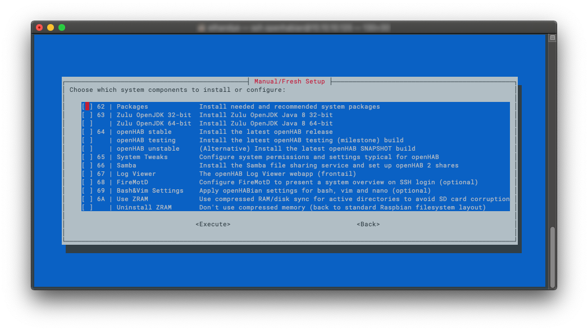



<!-- Attention authors: Do not edit directly. Please add your changes to the appropriate source repository -->

# openHABian - Hassle-free openHAB Setup

The Raspberry Pi and other small single-board computers are quite famous platforms for openHAB.
However, setting up a fully working Linux system with all recommended packages and openHAB recommendations is a **boring task** taking quite some time and **Linux newcomers** shouldn't worry about these technical details.

<p style="text-align: center; font-size: 1.2em; font-style: italic;"><q>A home automation enthusiast doesn't have to be a Linux enthusiast!</q></p>

openHABian aims to provide a **self-configuring** Linux system setup specific to the needs of every openHAB user.
To that end, the project provides two things:

* Complete **SD-card images pre-configured with openHAB** and many other openHAB- and Hardware-specific preparations for the Raspberry Pi and the Pine A64
* The openHABian Configuration Tool to set up and configure openHAB and many related things on any Debian/Ubuntu based system

#### Table of Content

{::options toc_levels="2..3"/}

- TOC
{:toc}

## Features

The following features are provided by the openHABian images out of the box:

- Hassle-free setup without a display or keyboard, connected via [Ethernet or Wi-Fi](#wifi-setup)
- openHAB 2 in the latest stable version
- Zulu Embedded OpenJDK Java 8
- [openHABian Configuration Tool](#openhabian-config) including updater functionality
- openHAB Log Viewer (based on [frontail](https://github.com/mthenw/frontail))
- Samba file sharing with [pre-configured to use shares](https://www.openhab.org/docs/installation/linux.html#mounting-locally)
- Useful Linux packages pre-installed, including `vim, mc, screen, htop, ...`
- Login information screen, powered by [FireMotD](https://github.com/OutsideIT/FireMotD)
- Customized Bash shell experience
- Customized vim settings, including [openHAB syntax highlighting](https://github.com/cyberkov/openhab-vim)
- Customized nano settings, including [openHAB syntax highlighting](https://github.com/airix1/openhabnano)
- [Raspberry Pi specific](rasppi.html): Extend to the whole SD card, 16MB GPU memory split

Additionally the **openHABian Configuration Tool** [`openhabian-config`](#openhabian-config) is included and provides the following optional settings and components:


- Switch over to the latest *Milestone* or *Snapshot* release of openHAB 2 [*unstable/SNAPSHOT* build](https://www.openhab.org/docs/installation/linux.html#changing-versions)
- Install and Setup a [reverse proxy](security.html#nginx-reverse-proxy) with password authentication and/or HTTPS access (incl. [Let's Encrypt](https://letsencrypt.org) certificate) for self-controlled remote access
- Set up a Wi-Fi connection
- Bind the [openHAB remote console]({{base}}/administration/console.html) to all interfaces
- Setup [Backup](#backup) for your system
- Easily install and preconfigure [Optional Components](#optional-components) of your choice
- ... and many more
- Raspberry Pi specific:
  - Prepare the serial port for the use with extension boards like Razberry, SCC, Enocean Pi, ...
  - Move the system partition to an external USB stick or drive

## Quick Start

Here you'll find supported and tested installation platforms and instructions.

### Raspberry Pi (Prepackaged SD-Card Image)

**Flash, plug, wait, enjoy:**
The provided image is based on the [Raspbian Lite](https://www.raspberrypi.org/downloads/raspbian) standard system.
On first boot the system will set up openHAB and the mentioned settings and tools.
All packages will be downloaded in their newest version and configured to work without further modifications.
The whole process will take a few minutes, then openHAB and all other needed tools to get started will be ready to use without further configuration steps.
openHABian is designed as a headless system, you will not need a display or a keyboard.

Learn more about the Raspberry Pi as your platform for openHAB and about the requirements over in our [Raspberry Pi article](rasppi.html).

**Setup:**

- [Download the latest "openHABianPi" SD card image file](https://github.com/openhab/openhabian/releases) (Note: the file is *xz* compressed)
- Write the image to your SD card (e.g. with [Etcher](https://etcher.io), able to directly work with *xz* files)
- Insert the SD card into the Raspberry Pi, connect Ethernet ([Wi-Fi supported](#wifi-setup)) and power
- Wait approximately **15-45 minutes** for openHABian to do its magic. <br>(You can check the progress in your web-browser [here](http://openhab).)
- Enjoy! 🎉


- The device will be available under its IP or via the local DNS name `openhab`
- [Connect to the openHAB 2 dashboard](https://www.openhab.org/docs/configuration/packages.html): [http://openhab:8080](http://openhab:8080)
- [Connect to the Samba network shares](https://www.openhab.org/docs/installation/linux.html#mounting-locally) with username `openhabian` and password `openhabian`
- Connect to the openHAB Log Viewer (frontail): [http://openhab:9001](http://openhab:9001)
- If you encounter any setup problem, [please continue here](#successful)

You can stop reading now.
openHABian has installed and configured your openHAB system and you can start to use it right away.
If you want to get in touch with the system or want to install one of the previously mentioned optional features, you can come back here later.

Ready for more?
[Connect to your Raspberry Pi SSH console](https://www.raspberrypi.org/documentation/remote-access/ssh/windows.md) using the username `openhabian` and password `openhabian`.
You will see the following welcome screen:


➜ Continue at the ["openHABian Configuration Tool"](#openhabian-configuration-tool) chapter below!

### Other Linux Systems (add openHABian just like any other software)

openHABian also supports general Debian/Ubuntu based systems on different platforms.
Starting with a fresh installation of your operating system, install git, then clone the openHABian project and finally execute the openHABian configuration tool:

```shell
# install git
sudo apt-get update
sudo apt-get install git

# download and link
sudo git clone https://github.com/openhab/openhabian.git /opt/openhabian
sudo ln -s /opt/openhabian/openhabian-setup.sh /usr/local/bin/openhabian-config

# execute
sudo openhabian-config
```

You'll see the openHABian configuration menu and can now select all desired actions.
The "Manual/Fresh Setup" submenu entry is the right place for you. Execute all entries one after the other to get the full openHABian experience:



> Attention:
> openHABian usage on a custom system is supported and should be safe.
> Still some routines might not work for you.
> Please be cautious and have a close look at the console output for errors.
> Report problems you encounter to the [openHABian Issue Tracker](https://github.com/openhab/openhabian/issues).

{: #wifi-setup}
### Wi-Fi based Setup Notes

If you own a RPi3, RPi3+, RPi4, a RPi0W, a Pine A64, or a compatible Wi-Fi dongle you can set up and use openHABian purely via Wi-Fi.
For the setup on Wi-Fi, you'll need to make your SSID and password known to the system before the first boot.
Additionally to the setup instructions given above, the following steps are needed:

- Flash the system image to your micro SD card as described, do not remove the SD card yet
- Access the first SD card partition from the file explorer of your choice (e.g. Windows file explorer)
- Open the file `openhabian.conf` in a text editor
- Uncomment and fill in `wifi_ssid="My Wi-Fi SSID"` and `wifi_psk="password123"`
- Save, Unmount, Insert, Boot
- Continue with the instructions for the Raspberry Pi or Pine A64

{: #openhabian-config}
## openHABian Configuration Tool

The following instructions are oriented at the Raspberry Pi openHABian setup but are transferable to all openHABian environments.

Once connected to the command line console of your system, please execute the openHABian configuration tool by typing the following command.
(Hint: sudo executes a command with elevated rights and will hence ask for your password: `openhabian`).

```shell
sudo openhabian-config
```


The configuration tool is the heart of openHABian.
It is not only a menu with a set of options, it's also used in a special unattended mode inside the ready to use images.

⌨ - A quick note on menu navigation.
Use the cursor keys to navigate, &lt;Enter&gt; to execute, &lt;Space&gt; to select and &lt;Tab&gt; to jump to the actions on the bottom of the screen. Press &lt;Esc&gt; twice to exit the configuration tool.

### Linux Hints

If you are unfamiliar with Linux, SSH and the Linux console or if you want to improve your skills, read up on these important topics.
A lot of helpful articles can be found on the internet, for example:

- "Learn the ways of Linux-fu, for free" interactively with exercises at [linuxjourney.com](https://linuxjourney.com).
- The official Raspberry Pi help articles over at [raspberrypi.org](https://www.raspberrypi.org/help)
- "Now what?", Tutorial on the Command line console at [LinuxCommand.org](http://linuxcommand.org/index.php)

*The good news:* openHABian helps you to stay away from Linux - *The bad news:* Not for long...

Regardless of if you want to copy some files or are on the search for a solution to a problem, sooner or later you'll have to know some Linux.
Take a few minutes to study the above Tutorials and get to know the most basic commands and tools to be able to navigate on your Linux system, edit configurations, check the system state or look at log files.
It's not complicated and something that doesn't hurt on ones résumé.

### First Steps with openHAB

After your first setup of openHABian is successful and you are able to access the openHAB dashboard, you should dig into the possibilites.
Install [Bindings](https://www.openhab.org/addons/), discover your devices, and [configure your smart home](https://www.openhab.org/docs/configuration/).
You might want to start defining [Items](https://www.openhab.org/docs/configuration/items.html), [Sitemap](https://www.openhab.org/docs/configuration/sitemaps.html) and [HABPanel](https://www.openhab.org/docs/configuration/habpanel.html) dashboard for your home.
To kickstart that process you may check out the openHAB [Home Builder](https://www.openhab.org/docs/configuration/homebuilder.html).

These are just some first hints.
Be sure to read up on the [Configuration](https://www.openhab.org/docs/configuration/) section of the documentation page to learn more.

{: #further-config}
### Further Configuration Steps

openHABian is supposed to provide a ready-to-use openHAB base system. There are however a few things we can not decide for you.

- **Time Zone:** The time zone of your openHABian system will be determined based on your internet connection. In some cases you might have to adjust that setting.
- **Language:** The `locale` setting of the openHABian base system is set to "en_US.UTF-8". While this setting will not do any harm, you might prefer e.g. console errors in German or Spanish. Change the locale settings accordingly. Be aware, that error solving might be easier when using the English error messages as search phrases.
- **Passwords:** Relying on default passwords is a security concern you should care about! The openHABian system is preconfigured with a few passwords you should change to ensure the security of your system. This is especially important if your system is accessible from outside your private subnet.

All of these settings **can easily be changed** via the openHABian Configuration Tool.

Here are the passwords in question with their respective default "username:password" values. 
All password can be changed from openHABian menu.

{: #passwords}
- User password needed for SSH or sudo (e.g. "openhabian:openhabian")
- Samba share password (e.g. "openhabian:openhabian")
- openHAB remote console (e.g. "openhab:habopen")
- Amanda backup password (no default, applied when installing)
- Nginx reverse proxy login (no default, applied when installing) *For manual configuration see [here](https://www.openhab.org/docs/installation/security.html#adding-or-removing-users).*
- InfluxDB (No password set by default)
- Grafana visualization ("admin:admin")

## System Backup & Maintenance 
Once you have gotten grip on how to use openHAB for your needs it is a good moment to think about backup. Maybe you accidently delete something or get hit by SD card wearout problem which is quite common on many single board computers such as Raspberry Pis.

There are four measures and methods in openHABian to cover this matter today, but they all need some research and readup to be successfully used. *(Hopefully we will get to develop a more streamlined method to better integrate with openHAB itself - stay tuned.)*

1. Use openHAB integrated [backup tool](https://community.openhab.org/t/recommended-way-to-backup-restore-oh2-configurations-and-things/7193/82?u=elias_gabrielsson).
2. Move the root filesystem to an external USB-memory. Warning: USB stick are as-susceptible to flash wearout as SD cards. [Menu option:37]
3. (BETA) Reduce wear on SD card by moving write intensive actions temporary to RAM during operation (logs,persistant-data). Warning: power failure will result in lost data. [Menu option: 6A]
4. (Advanced) Use [Amanda Network Backup](http://www.amanda.org/) for full system backup, longer introduction [here](https://github.com/openhab/openhabian/blob/master/docs/openhabian-amanda.md). [Menu option: 51]

## Optional Components

openHABian comes with a number of additional routines to quickly install and set up home automation related software.
You'll find all of these in the [openHABian Configuration Tool](#openhabian-config)

- [frontail](https://github.com/mthenw/frontail) - openHAB Log Viewer accessible from [http://openhab:9001](http://openhab:9001)
- Mi Flora MQTT demon
- [InfluxDB and Grafana](https://community.openhab.org/t/influxdb-grafana-persistence-and-graphing/13761/1) - persistence and graphing available from [http://openhab:3000](http://openhab:3000)
- [Eclipse Mosquitto](http://mosquitto.org) - Open Source MQTT v3.1/v3.1.1 Broker
- [Node-RED](https://nodered.org) - "Flow-based programming for the Internet of Things", with preinstalled [openHAB2](https://flows.nodered.org/node/node-red-contrib-openhab2) and [BigTimer](https://flows.nodered.org/node/node-red-contrib-bigtimer) add-ons. Accessible from [http://openhab:1880](http://openhab:1880)
- [Homegear](https://www.homegear.eu/index.php/Main_Page) - Homematic control unit emulation
- [KNXd](http://michlstechblog.info/blog/raspberry-pi-eibknx-ip-gateway-and-router-with-knxd) - KNX daemon running at `224.0.23.12:3671/UDP`
- [OWServer](http://owfs.org/index.php?page=owserver_protocol) - 1wire control system
- [FIND](https://www.internalpositioning.com/) - the Framework for Internal Navigation and Discovery
- Tellstick core

## FAQ and Troubleshooting

For openHABian related questions and further details, please have a look at the main discussion thread in the Community Forum:

- [https://community.openhab.org/t/13379](https://community.openhab.org/t/13379)

If you want to get involved, you found a bug, or just want to see what's planned for the future, come visit our Issue Tracker:

- [https://github.com/openhab/openhabian/issues](https://github.com/openhab/openhabian/issues)

{: #changelog}
#### Where can I find a changelog for openHABian?

The official changelog announcements are posted [here](https://community.openhab.org/t/13379/1) and [here](https://github.com/openhab/openhabian/releases), be sure to check these out regularly.
If you want to stay in touch with all the latest code changes under the hood, see the [commit history](https://github.com/openhab/openhabian/commits/master) for openHABian.
You'll also see added commits when executing the "Update" function within the openHABian Configuration Tool.

{: #successful}
#### Did my Installation succeed? What to do in case of a problem?

**A note on patience:**
Remember to stay calm.
The openHABian setup will take 15 up to 45 minutes to complete all steps.
This time highly depends on your device's performance, your internet connection and sometimes even on the load of external servers.

<!--
##### LED Indication (RPi only)

During and after the first boot of your Raspberry Pi, the green on-board LED will indicate the setup progress (no display needed):

* `❇️️ ❇️️    ❇️️ ❇️️     ` - Steady "heartbeat": setup **successful**
* ` ❇️️         ❇️️❇️️❇️️ ` - Irregular blinking: setup in progress...
* `❇️️ ❇️️ ❇️️ ❇️️ ❇️️ ❇️️ ❇️️` - Fast blinking: error while setup
-->

**RPi note:**
The progress indication via the **green Raspberry Pi LED** is currently not possible and hence not part of the openHABian v1.3 image.
We will re-add the functionality as soon as the underlying issue is resolved.

##### openHAB Dashboard

After the installation of openHABian was successful, you should be able to access the openHAB dashboard:

- Raspberry Pi image setup: [http://openhab:8080](http://openhab:8080)
- In any case: [http://your-device-hostname:8080](http://your-device-hostname:8080) or [http://192.168.0.2:8080](http://192.168.0.2:8080) (replace name/IP)

##### SSH Progress Report

It is always possible to [connect to the SSH console](https://www.raspberrypi.org/documentation/remote-access/ssh/windows.md) of your device (after a few minutes of boot up time).
During the setup process you'll be redirected to the live progress report of the setup.
The report can also be checked for errors after the installation finished by executing: `cat /boot/first-boot.log`

The progress of a successful installation will look similar to the following:


Wait till the log tells you that the setup was "successful", then reconnect to the device.

##### SSH Login Screen

If the installation was **successful** you will see the normal login screen as shown in the first screenshot.
If the installation was **not successful** you will see a warning and further instructions as shown in the second screenshot.

<div class="row">
  <div class="col s12 m5"></div>
  <div class="col s12 m5 offset-m2"></div>
</div>

##### What Next?

If you are not able to access your system via the openHAB dashboard or SSH after more than one hour, chances are high that your hardware setup is the problem.
Try using a steady power source and a reliable SD card, double check the network connection.
Restart the complete setup process to rule out most other possible causes.

Contact the [openHABian community forum thread](https://community.openhab.org/t/13379) if the problem persists.

{: #switch-openhab-branch}
#### Can I switch from openHAB 2 stable to the testing or unstable branch?

openHABian installs the latest stable build of openHAB 2.
If you want to switch over to the snapshot or milestone release, please do so via the openHABian Configuration Tool.
Switching from stable to newer development releases might introduce changes and incompatibilities, so please be sure to make a full openHAB backup first!

Check the Linux installation article for all needed details: [Linux: Changing Versions](https://www.openhab.org/docs/installation/linux.html#changing-versions)

{: #headache}
#### Where is the graphical user interface?

You've just installed openHABian and are confused.
No fancy login screen, no windows, no mouse support. What did I get into?

You are not the first one to get confused about the **intended use case of openHABian** or most other solutions based on a Raspberry Pi.
Maybe it helps to not think of the RPi as a PC as we know it.
It is not (necessarily) build to be used with a keyboard and display.
You already own a **powerful PC or Mac** which you should benefit from.
It would be a shame to have a powerful computer at your fingertips and then have to **restrict yourself** to a very limited graphical frontend on another device, wouldn't you agree?

The intended use case of a lot of these small SBCs is to sit in a corner and provide a service reliably 24/7.
You'll find that most solutions for the RPi are characterized by this.

Moving on.
What *we* actually want and what openHABian is aimed for is a **dedicated headless system** to **reliably execute openHAB** and to **expose all interfaces** needed to interact and configure it (PaperUI, BasicUI, HABPanel, openHAB LogViewer, Samba Network Shares, openHABian Configuration Tool, SSH).
If you know how to work with these interfaces, you are set for a way better experience than the alternatives.
The main challenge is to **get used to the Linux command line**, not even a GUI (like Pixel, see below) will relieve you from that in the long run.
If you are not willing to teach yourself a few fundamental Linux skills you will not become happy with any Linux system and should resort to a e.g. Windows machine.
However as you are willing to tinker with smart home technology, I'm sure you are ready to **teach yourself new stuff** and expand your experience.

**If** the above didn't convince you, execute the following commands to get the graphical user interface [Pixel](https://www.raspberrypi.org/blog/introducing-pixel) installed.
You have been warned, if there came any warranty with openHABian to begin with, it would end here.

```shell
sudo apt-get install raspberrypi-ui-mods
sudo reboot
```

After the reboot, connect via SSH and type the following command to start a VNC server to connect to:

```shell
vncserver -randr 1280x800
```

{: #faq-other-platforms}
#### Can I use openHABian on ...?

openHABian is restricted to Debian/Ubuntu based systems.
If your operating system is based on these or if your Hardware supports one, your chances are high openHABian can be used.
Check out the [Manual Setup](#manual-setup) instructions for guidance.

Differences between systems can still be a problem, so please check the [openHABian community forum thread](https://community.openhab.org/t/13379) or the [Issue Tracker](https://github.com/openhab/openhabian/issues) for more information.
Do not hesitate to ask!
